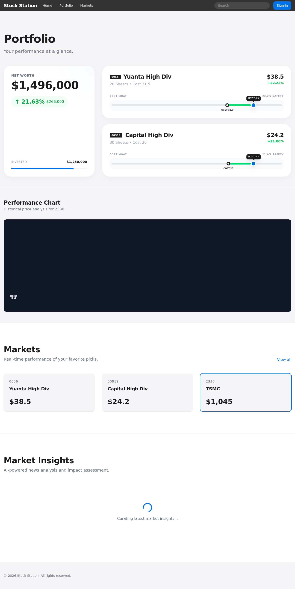

# 20260429_stock - 台股投資觀測站

一個採用 Apple Premium Minimalism 設計風格的台股投資觀測網站。本專案旨在提供乾淨、高效且美觀的介面，讓投資者能專注於核心數據（如 0056, 00919, 2330 等）的追蹤。

## 🚀 技術棧

- **前端 (Frontend)**: Vue 3 (Vite), Tailwind CSS, Axios, Vitest
- **後端 (Backend)**: Golang (Gin Gonic), GORM (PostgreSQL)
- **資料庫 (Database)**: PostgreSQL 16
- **基礎設施 (Infra)**: Docker, Docker Compose
- **設計規範 (Design)**: [DESIGN.md](./DESIGN.md) (Apple Style Spec)

## 🛠️ 快速開始

### 1. 環境配置
複製 `.env.example` 並設定您的資料庫密碼（目前已包含預設 `.env` 用於開發）。

### 2. 啟動服務
使用 Docker Compose 一鍵啟動所有服務（資料庫、後端、前端）：

```bash
docker-compose up --build
```

- 前端：`http://localhost:3000`
- 後端 API：`http://localhost:8080`
- 健康檢查：`http://localhost:8080/health`

## 🧪 自動化測試

本專案堅持測試先行 (TDD) 與全自動化驗證：

### 後端測試 (Go)
```bash
cd backend
go test ./...
```

### 前端測試 (Vue)
```bash
cd frontend
npm run test:unit
```

### 交付前完整測試
執行專案根目錄的交付腳本（開發中）：
```bash
./scripts/test-and-deliver.sh
```

## 🎨 系統預覽



## 🎨 設計理念
遵循 Apple 的「產品即主角」哲學：
- **極簡主義**：除去不必要的裝飾，只保留核心數據。
- **動態節奏**：黑色與淺灰色區塊交替，營造劇院般的視覺體驗。
- **互動焦點**：僅使用 Apple Blue (#0071e3) 作為唯一互動色。

## 📂 專案結構
- `backend/`: Golang API 服務。
- `frontend/`: Vue 3 單頁應用程式。
- `docs/plans/`: 詳細的開發實作計畫書。
- `DESIGN.md`: 設計令牌 (Tokens) 與 UI 規範。

---
Created by [ChungYenYu](https://github.com/ChungYenYu)
